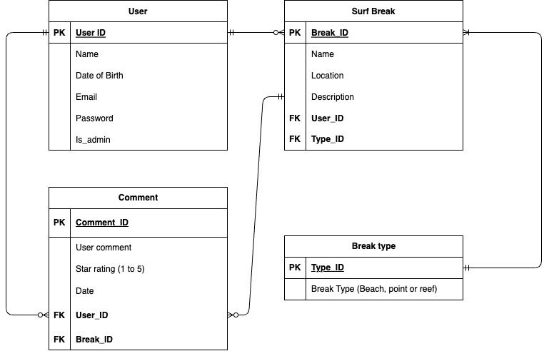

# Nicholas Ward - T2A2 - Surfing API

## GITHUB REPO

<https://github.com/NCF94/NicholasWard_T2A2>

## R1 and R2: Why a Surfing API?

As a beginner surfer who only recently took up surfing, I was trying to find local surf breaks to me that would be suitable for me to surf at. To my surprise, this was actually quite hard to do. There was very little, if any information online about surf breaks, their locations, and the level of surfing the break was suitable for. This is problem I wish to solve with this surfing API. This problem I think needs to be solved, so other people wanting to take up surfing, or even people travelling to the area can find a suitable surf break for them. With all the information available to the user, they can make an informed and confident decision on where they should surf, and when.

---

## R3: Why PostgreSQL?

I have chosen to use PostgreSQL because it is one of the most commonly used database system. It is what we have been taught to use so far at Coder Academy, and is the most logical choice for this assignment. PostgreSQL is supported on most operating systems and provides great scalability (Richard Peterson 2023). It also supports JSON by default (Richard Peterson 2023). Because PostgreSQL is fully open source it allows us to use it how we want and how our app requires.(Richard Peterson 2023) This also means it is free to use.
Some of the drawbacks for PostgrSQL are that it has slower performance to other database management systems like MySQL (Richard Peterson 2023). It can be quite difficult for beginners to download (Richard Peterson 2023). PostgreSQL also may not be supported by open source apps like MySQl is (Richard Peterson 2023).

---

## R4: Key functionalities and benefits of an ORM

An Object Relational Mapper (ORM) is a tool used to bridge the gap between a database and an object oriented programming language. They allow developers to work with data in the form of objects, while the data is stored and queried in the database management system. It allows us to use our preferred programming language to write queries in our chosen language instead of SQL queries (Mario Hoyos 2018). So in our case, we can use Python to create, read, update and delete data and schemas in our database. This is a significant benefit to programmers because it allows us to use the languages we are comfortable in, instead of SQL (Mario Hoyos 2018). Because they allow the programmer to use their preferred language, it's makes switching from PostgrSQL , MySQL etc fairly easy (Mario Hoyos 2018). Another benefit is that you get a lot of advanced features from the ORM, depending on what one you choose (Mario Hoyos 2018). This can be things like support for transactions, migration, seeds, streams etc (Mario Hoyos 2018). Using an ORM tool can speed up development and reduce the cost of development (Ihechikara Vincent Abba 2022). The ORM handles the logic required to interact with databases (Ihechikara Vincent Abba 2022). ORM's also improve security, and reduce the amount of code needing to be written when compared to using SQL (Ihechikara Vincent Abba 2022).

---

## R5: API Endpoints

## auth_controller.py

### /auth/register

HTTP Request: POST

Required data:

- Name - Name must be entered (string).
- Date of birth - Date of birth must be entered (string).
- Email - Email must be entered (string).
- Password - Password must be entered (string). Password is encrypted using bcrypt.

Expected responses:

- If the email is already in use, an error message is given stating so.
- If a required field is not input, an error message is given stating which field was missing.
- If name doesnt meet requirements, an error message is returned.
- If registration is successfull, the route will return the user ID, name, date of birth, email and is_admin (true or flase) in JSON format.

Authentication methods: Null.

### /auth/login

HTTP Request: POST

Required data:

- Email - The user email (string).
- Password - The user password (string).

Expected response:

- If email or password is incorrect, an error message is given in JSON format.
- If login is successfull, the route will return the user email, a authentication 'token' and if the user is_admin in JSON format.

Authentication methods: Null.

---

## surf_break_controller.py

### /surf_breaks

HTTP Request: GET

Required data: Null.

Expected response:

- When the request is successful the route will return a list of surf breaks. In each surf break will be the surf break ID, name, location, description, the user who added the surf break (user name and email), comments associated with the surf break (comment ID, user who commented (user name and email), a rating, date commented, the comment message, the break type (type ID and break type)) in JSON format.

Authentication methods: Null.

### /surf_breaks/int:id

HTTP Request: GET

Required data: Null.

Expected response:

- When successfull, the route will return surf break ID, name, location, description, the user who added the surf break (user name and email), comments associated with the surf break (comment ID, user who commented (user name and email), a rating, date commented, the comment message, the break type (type ID and break type)) in JSON format.
- If the surf break doesn't exist with the ID input, an error message will be returned saying it doesnt exist in JSON format.

Authentication methods: Null

### /surf_breaks

HTTP Request: POST

Required data:

- Surf break name - (string) The name of the surf break, this is required.
- Location - (string) The location of the surf break, this is required.
- Description - (string) A description of the surf break, this is optional.

Expected response:

- When successful, the route will return the added surf break ID, name, location, description, the user who added the surf break (user name and email), comments associated with the surf break (comment ID, user who commented (user name and email), a rating, date commented, the comment message, the break type (type ID and break type)) in JSON format.
- If the surf break name is not entered, or entered incorrectly an error mesaage will be returned in JSON format.
- If the surf break location is not entered, or entered incorrectly an error mesaage will be returned in JSON format.

Authentication methods: JWT Token is required (must be logged in)

### /surf_breaks/int:id

HTTP Request: DELETE

Required data:

- The ID of the surf break you wish to delete (integer).

Expected response:

- If successful, a message wil be returned saying which surf break was deleted in JSON format.
- If not admin, an error message will be returned stating you arnt authorised to delete in JSON format.

Authentication methods: JWT Token is required (must be logged in), must be admin to delete surf breaks.

### /surf_breaks/int:id

HTTP Request: PUT, PATCH

Required data:

- The ID of the surf break that requires updating in JSON format (integer).
- The name, location and description with the updated information in JSON format (string). 

Expected response:

- When successful, the route will return the updated surf break, with the surf break ID, name, location, description, the user who added the surf break (user name and email), comments associated with the surf break (comment ID, user who commented (user name and email), a rating, date commented, the comment message, the break type (type ID and break type))
- If name or location is attempted to be updated without meeting criteria, an error message is given.

Authentication methods: JWT Token is required (must be logged in)

---

## break_type_controller.py

### /surf_breaks/int:id/break_type

HTTP Request: POST

Required data:

- The ID of the surf break which you are adding the break type (integer).
- The break type (must be one of reef, beach or point) (string).

Expected response:

- If successful, the route will return the type_ID and the break type of the surf break in JSON format.

Authentication methods: JWT Token is required (must be logged in)

### /surf_breaks/int:id/break_type/int:type_id

HTTP Request: DELETE

Required data:

- The ID of the surf break which you are deleting the break type (integer).
- The ID of the break_type which you are deleting (integer)

Expected response:

- If successful, a message is retured stating which break type was deleted in JSON format.
- If ID is wrong, a error message is returned stating that the break type was not found, in JSON format

Authentication methods: JWT Token is required (must be logged in)

### /surf_breaks/int:id/break_type/int:type_id

HTTP Request: PUT, PATCH

Required data:

- The ID of the surf break which you are updating the break type (integer).
- The break type (must be one of reef, beach or point) you wish to update (string).

Expected response:

- If successful, the route will return the type_ID and the break type of the surf break in JSON format.
- If ID is wrong, a error message is returned stating that the break type was not found, in JSON format

Authentication methods: JWT Token is required (must be logged in)

## comment_controller.py

### /surf_breaks/int:id/comments

HTTP Request: POST

Required data:

- The ID of the surf break which you are commenting (integer).
- The "user comment", or the comment you wish to add to the surf break (string)
- The rating of the surf break, if you wish to add one (string).

Expected response:

- If successful, the route will return the comment ID, the user who made the comment (name and email), the rating, date the comment was added and the user comment in JSON format

Authentication methods: JWT Token is required (must be logged in)

### /surf_breaks/int:id/comments/int:comment_id

HTTP Request: DELETE

Required data:

- The ID of the surf break which the comment you want to delete belongs to (integer).
- The ID of the comment you wish to delete (integer)

Expected response:

- If successful, a message saying what comment was deleted will be returned in JSON format
- If the wrong ID is used, error message will be returned saying comment not found with that ID in JSON format

Authentication methods: JWT Token is required (must be logged in)

### /surf_breaks/int:id/comments/int:comment_id

HTTP Request: PUT, PATCH

Required data:

- The ID of the surf break which you are commenting (integer).
- The ID of the comment you wish to update (integer)

Expected response:

- If successful, the route will return the comment ID, the user who made the comment (name and email), the rating, date the comment was added and the updated user comment in JSON format
- If the wrong ID is used, error message will be returned saying comment not found with that ID in JSON format

Authentication methods: JWT Token is required (must be logged in)

## R6: ERD



---

## R7: Third party services

Third party services used:

- Flask - A web application framework written in Python, originally created by Armin Ronacher (PythonBasics 2021). It's a micro-framework that does not include an ORM and it has a small and easy to extend core(PythonBasics 2021). Some of its may features include url routing and template engine(PythonBasics 2021). Flask has quite a small learning curve, which is good for beginners(PythonBasics 2021). Being one of the most popular frameworks means it's up to date and modern(PythonBasics 2021). It is also easy to extend its functionality and it great for large scale complex applications if required(PythonBasics 2021).
- SQLAlchemy - A Python SQL toolkit and object relational mapper thats app developers the full flexibility and power of SQL(SQLAlchemy). It was designed for efficient and high performing database access, has a suite of well know enterprise level persistence patterns and has been adapted into a simple and Pythonic domain language(SQLAlchemy). It allows developers to connect databases using Python and run SQl queries using object base programming.
- Bcrpyt - A cryptographic hash function designed for password hashing and safe storing in the backend of applications (Monika Grigutytė 2023). It is less susceptible to cyberattacks because when hashing the given password, it adds random data called salt, which creates a unique hash that is almost impossible to break (Monika Grigutytė 2023). Each time someone logs into their account, bcrypt hashes their password, then this is compared to the version stored in the systems memory (Monika Grigutytė 2023).
- Psycopg2 - The most popular PostgreSQL database adapter for Python (Federico Di Gregorio, Daniele Varrazzo 2021). The most popular PostgreSQL database adapter for Python(Federico Di Gregorio, Daniele Varrazzo 2021). Complete implementation of the Python DB API 2.0 specification and the thread safety are it's main features(Federico Di Gregorio, Daniele Varrazzo 2021). It was designed for heavy multithreaded application that create and destroy lots of cursors and make a large number of concurrent INSERTS or UPDATES(Federico Di Gregorio, Daniele Varrazzo 2021).
- Marshmallow - An object relational mapping library that converts objects to and from python data types (Bashir Alam). Marshmallow is often used alongside SQLAlchemy (Bashir Alam). Marshmallow serialises and deserialises python dicts to SQLAlchemy models and vice versa (Bashir Alam).
- JSON Web Token (JWT)- A JSON Object which is used to securely transfer data over the internet (Aman Neekhara 2021). Commonly used for authentication systems and information exchange (Aman Neekhara 2021). The token is made up of a header (type of token and algorithm), payload (information being exchanged) and signature (used to validate contents of the exchange) (Aman Neekhara 2021). It is often used in web apps to verify a users identity (Aman Neekhara 2021).

---

## R8: Models and their relationships

The models I have used are:

- SurfBreak
- BreakType
- Comments
- User

### User

The User Model fields are ID (primary key), name, date of birth, email, password, is_admin.

The relationships for the User Model are:

- User has a one to many relationship with the SurfBreak model, a single user can create mutiple surf breaks. A user back populates many surf breaks
- User has a one to many relationship with the Comment model, a single user can create multiple comments. When a user is deleted, so are all their comments. A user back populates many comme

``` Python
class User(db.Model):
    __tablename__ = 'users' #users table

    #columns in table
    id = db.Column(db.Integer, primary_key=True) #primary key
    name = db.Column(db.String(50), nullable=False)
    date_of_birth = db.Column(db.String, nullable=False)
    email = db.Column(db.String, nullable=False, unique=True)
    password = db.Column(db.String, nullable=False)
    is_admin = db.Column(db.Boolean, default=False)
    
    #relationships
    surf_break = db.relationship('SurfBreak', back_populates='user') 
    comments = db.relationship('Comment', back_populates='user', cascade='all, delete')
```

### SurfBreak

The SurfBreak Model fields are ID (primary key), name, location, description, user_id (foreign key) and break_type_id (foreign key).

The relationships for the SurfBreak Model:

- SurfBreak has a one to many relationship with the User Model, a single user can create mutiple surf breaks. A user back populates many surf breaks
- SurfBreak has a one to many relationship with the BreakType Model, a single break type can be assigned to multiple surf breaks. A break type back populates many surf breaks

``` Python
class SurfBreak(db.Model):
    __tablename__ = "surf_breaks" #surf breaks table
    
    #columns in table
    id = db.Column(db.Integer, primary_key=True)  #Primary Key
    name = db.Column(db.String, nullable=False) #cant be empty
    location = db.Column(db.String, nullable=False)
    description = db.Column(db.Text)
    
    user_id = db.Column(db.Integer, db.ForeignKey('users.id'), nullable=False) #foreign key, maps to id column of users table
    break_type_id = db.Column(db.Integer, db.ForeignKey('break_type.type_id')) #foreign key, maps to type_id column of break_type table
    
    #relationships
    user = db.relationship('User', back_populates='surf_break') 
    comments = db.relationship('Comment', back_populates='surf_break') 
    break_type = db.relationship('BreakType', back_populates='surf_break', uselist=False)
```

### BreakType

The BreakType Model fields are type_ID (primary key) and break type.

The relationships for the BreakType model are:

- Break type has a one to many relationship with SurfBreak, a single break type can be assigned to multiple surf breaks. A break type back populates many surf breaks

``` Python
class BreakType(db.Model):
    __tablename__ = 'break_type' #breaktype table
    
    #columns in table
    type_id = db.Column(db.Integer, primary_key=True) # PRimary Key
    break_type = db.Column(db.String)

    # relationships
    surf_break = db.relationship('SurfBreak', back_populates='break_type', uselist=False) 
```

### Comments

The Comment Model fields are comment_ID (primary key), user_comment, rating, date, user_id (foreign key) and break_id (foreign key).

The relationships for the Comment model are:

- Comment has a one to many relationship with the User model, a single user can have many comments. A user back populates multiple comments
- Comment has a one to many relationship with the SurfBreak model, a single surf break can have multiple comments. A surf break back populates multiple comments

``` Python
class Comment(db.Model):
    __tablename__ = 'comments' #comments table

    #columns in table
    comment_id = db.Column(db.Integer, primary_key=True) #primary key
    user_comment = db.Column(db.Text)
    rating = db.Column(db.String)
    date = db.Column(db.Date, nullable=False)

    user_id = db.Column(db.Integer, db.ForeignKey('users.id'), nullable=False) #foreign key, maps to id column of users table
    break_id = db.Column(db.Integer, db.ForeignKey('surf_breaks.id'), nullable=False) #foreign key, maps to id column of surf_breaks table
    
    #relationships
    user = db.relationship('User', back_populates='comments') 
    surf_break = db.relationship('SurfBreak', back_populates='comments')
```

---

## R9: Database relations

In my surfing API, I will use‹ four different tables in my database. They are:

- users
- surf breaks
- break type
- comments

users table:

- Looking at my ERD we can see that the user table has a one to many relationship with the comments and surf breaks tables. User ID will be used as the primary key for the user table. The columns in the user table will be ID (primary key), name, date of birth, email, password and is_admin.
- The one to many relationship between comments and surf breaks tables will be established by using the user ID as a foreign key in the comments and surf breaks tables respectively


surf breaks table:

- Looking at my ERD we can see the surf breaks table has a one to many relationship with the comments table, and a many to one relationship with the user and break type tables. Break id will be used as the primary key for this table. The columns in the surf breaks table will be ID(primary key), name, location, description, user_id(foreign key) and break_type_id(foreign key)
- The one to many relationship between the comments table will be established by using the break id as a foreign key in the comments table
- The many to one relationships between surf breaks table and the user and break type tables will be established by using the user id and break type id as foreign keys in the surf breaks table


break type table:

- Looking at my ERD we can see the break type table has a one to many relationship with the surf breaks table. Type id will be used as the primary key for the break type table The columns in the break type table will be type id (primary key) and break type
- The one to many relationship between the break type table and the surf breaks table will be established by using the type id as a foreign key in the surf breaks table (break type id)


comments table:

- Looking at my ERD we can see the comments table has a many to one relationship with the users table and the surf breaks table. Comment id will be used as the primary key for the comments table. The columns in the comment table will be comment id, user comment, rating, date, user id (foreign key) and break id (foreign key).
- the many to one relationships between the comments table and the users and surf breaks tables will be established by using the user id and break id as foreign keys in the comments table.


---

## R10: Task allocation and tracking

Trello Board: <https://trello.com/invite/b/OY2AkCuc/ATTI3613415dd53808d4c4476531d7db79ef1E079F29/surfing-api>

I decided to use Trello to create, allocate and track the tasks required in my project as I am already familiar with Trello boards from previous assignments.

I created four lists on my trello board. Plan, Coding, Testing and Documentation. The plan list consisted of my planning steps and some documentation related to planning. These included R1, R2, R3, R4, R5(endpoints), R6 (ERD), R7, R9. I then moved on to the Coding list, this consisted of things like Setup and file structure, and then each individual model/schema had its own card with a checklist of things I needed to do. Next up was the Testing list, this was the final check to make sure any errors the occurred where handled correctly and the app didn't break, and to make sure everything worked as it should (CRUD). I also checked all my database tables to ensure that they where matching my ERD. The last list was documentation, this was just a small list of things I needed to complete once the API was built and working.

I tried to allow decent gaps between stages so that if there was any bugs or faults, I had plenty of time to fix them. This was the case, so I think I planned pretty well for this. Using Trello worked well, because it allowed me to easily follow my plan and implement each piece of the puzzle step by step. Its also a good way to make sure you haven't missed anything.

---

## References

- Richard Peterson (10/06/23) What is PostgreSQL? Introduction, Advantages & Disadvantages <https://www.guru99.com/introduction-postgresql.html#3>
- Mario Hoyos (25/12/18) What is an ORM and Why You Should Use it <https://blog.bitsrc.io/what-is-an-orm-and-why-you-should-use-it-b2b6f75f5e2a>
- Ihechikara Vincent Abba (21/10/22) What is an ORM – The Meaning of Object Relational Mapping Database Tools <https://www.freecodecamp.org/news/what-is-an-orm-the-meaning-of-object-relational-mapping-database-tools/>
- PythonBasics (2021) What is FLask Python <https://pythonbasics.org/what-is-flask-python/>
- SQLAchemy <https://www.sqlalchemy.org/>
- Monika Grigutytė (16/06/23) What is bcrypt and how does it work? <https://nordvpn.com/blog/what-is-bcrypt/>
- Federico Di Gregorio, Daniele Varrazzo (2021) Psycopg – PostgreSQL database adapter for Python <https://www.psycopg.org/docs/>
- Bashir Alam () Python Marshmallow explained <https://www.golinuxcloud.com/python-marshmallow/>
- Aman Neekhara (21/12/21) JSON web token <https://www.geeksforgeeks.org/json-web-token-jwt/>ß

---
